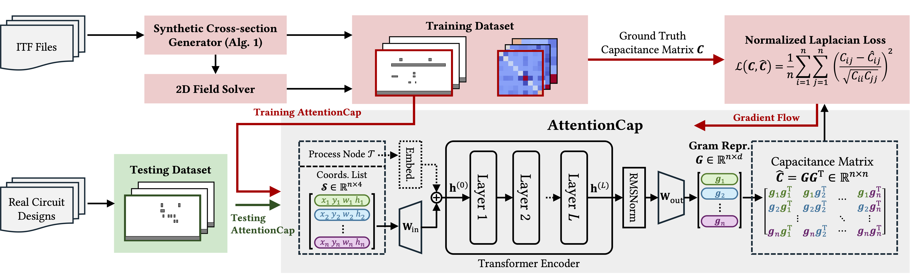

# AttentionCap: Transformer for 2D Capacitance Extraction

[](https://www.python.org/)
[](https://pytorch.org/)
[](https://docs.astral.sh/uv/)
[](https://www.dac.com/)

The official implementation of "AttentionCap: Transformer Based Capacitance
Matrix Learning Toward Full-Chip Extraction" (DAC'26). This repository
provides the full pipeline to reproduce all results in the paper.

<p align="center">
  <a href="figs/overview.pdf"></a>
</p>

## Quick Start

> [!IMPORTANT]
> Set `GPUS`, `MAX_CONCURRENCY`, datasets, and model configs in the relevant
> `scripts/config*.py` file before launching an experiment.

```bash
uv venv
source .venv/bin/activate
uv pip install -e .

python scripts/run_train.py
python scripts/run_eval.py
```

Training outputs are written under `training_output/`. Each AttentionCap run
creates a timestamped directory containing `train.log`, TensorBoard events,
and the best `ckpt.pt`. Evaluation selects the latest checkpoint and writes
`eval.log`.

### Experiment Entry Points

| Experiment | Prepare / Train | Evaluate | Configuration |
|---|---|---|---|
| Synthetic data | `pattern_gen/run_synthetic_train_samples.sh` | `pattern_gen/run_extract_test_samples.sh` | Variables inside both scripts |
| Convert synthetic data | `scripts/run_prepare_train_data.sh` | `scripts/run_prepare_test_data.sh` | `INPUT`, `OUTPUT` inside both scripts |
| AttentionCap on CNNCap data | `scripts/run_train_cnncap_data.py` | `scripts/run_eval_cnncap_data.py` | `scripts/config_cnncap_data.py` |
| Main results | `scripts/run_train.py` | `scripts/run_eval.py` | `scripts/config.py` |
| Pretrain | `scripts/run_train_pretrain.py` | `scripts/run_eval_pretrain.py` | `scripts/config_pretrain.py` |
| Adaptation | `scripts/run_train_adaptation.py` | `scripts/run_eval_adaptation.py` | `scripts/config_adaptation.py` |
| Architectural ablation | `scripts/run_train_ablation.py` | `scripts/run_eval_ablation.py` | `scripts/config_ablation.py` |
| CNNCap baseline | `baselines/cnncap/run_train.py` | `baselines/cnncap/run_eval.py` | `baselines/cnncap/config.py` |

## 1. Generate Synthetic Data

Generate synthetic random samples and extract their ground-truth labels with a field solver. This could take several hours.

```bash
bash pattern_gen/run_synthetic_train_samples.sh
bash pattern_gen/run_extract_test_samples.sh
```

Key variables to configure in both scripts:

- `target`: process node name, used to select `pattern_gen/configs/<target>.json`
  and `pattern_gen/itf_lib/<target>.ctf`.
- `-n`, `-p`, and `--seed`: generator parameters.
- Output: timestamped `.jsonl` data and `.log` files under
  `pattern_gen/pattern_gen_output/`.

`run_extract_test_samples.sh` uses
`pattern_gen/configs/asap7_structure_input.json`, which references fixed test
structures.

## 2. Convert Data

### 2.1 Synthetic
Convert generated training JSONL into train/validation tensors, and convert the
separate extracted test JSONL into `test_data.pt`:

```bash
bash scripts/run_prepare_train_data.sh
bash scripts/run_prepare_test_data.sh
```

Generated files are timestamped. Edit `INPUT` and `OUTPUT` in these scripts to
select the generated JSONL file and destination dataset directory. Processed
dataset directories contain `train_data.pt`, `val_data.pt`, and/or
`test_data.pt`.

### 2.2 CNNCap Benchmark

Place the following original CNNCap JSON datasets (from https://github.com/THU-numbda/CNNCap) under `data/cnncap/raw/`, or set `CNNCAP_RAW_DIR`:

```text
55nm_C_2_3_6.json
55nm_C_2_4_6.json
15nm_C_2_4_6.json
15nm_C_2_4_9.json
```

Then convert them to tensors:
```bash
bash scripts/run_prepare_cnncap_data.sh
```

Converted datasets are written under `data/cnncap/`.

## 3. AttentionCap on CNNCap Benchmark

This trains and evaluates AttentionCap using the open-source CNNCap datasets:

```bash
python scripts/run_train_cnncap_data.py
python scripts/run_eval_cnncap_data.py
```

Configure datasets, GPUs, model size, and batch size in
`scripts/config_cnncap_data.py`.

## 4. Main Results

Run ASAP7, Real65, and mix-node training.

```bash
python scripts/run_train.py
python scripts/run_eval.py
```

Configure the main datasets, model sizes, GPUs, concurrency, and output path in
`scripts/config.py`.

## 5. Pretrain and Adapt

Pretrain the AttentionCap model on the three process-node datasets:

```bash
python scripts/run_train_pretrain.py
python scripts/run_eval_pretrain.py
```

Then adapt the latest pretrain checkpoint to new process-node (ASAP7) using 10%, 50%, and 90% of
the training data:

```bash
python scripts/run_train_adaptation.py
python scripts/run_eval_adaptation.py
```

Configure these experiments in `scripts/config_pretrain.py` and
`scripts/config_adaptation.py`. Adaptation requires a completed pretrain run.

## 6. Architectural Ablation

```bash
python scripts/run_train_ablation.py
python scripts/run_eval_ablation.py
```

Configure model and ablation variants in `scripts/config_ablation.py`.

## 7. CNNCap Baseline Models

This is the standalone CNNCap ResNet34 baseline (largely following the official implementation https://github.com/THU-numbda/CNNCap), separate from AttentionCap:

```bash
python baselines/cnncap/run_train.py
python baselines/cnncap/run_eval.py
```

Configure datasets, process-node window widths, GPUs, batch sizes, and tasks in
`baselines/cnncap/config.py`.

- `goal="total"` predicts self/total capacitance.
- `goal="env"` predicts coupling capacitance.

Outputs are written under `training_output/cnncap_baseline/`. Evaluation writes
`val.log` and `test.log` with relative error, high-error ratio, FLOPs, parameter
count, and inference time.

## Citation

If you find this work useful, please cite:

```
@misc{huang2026attentioncaptransformerbasedcapacitance,
      title={AttentionCap: Transformer Based Capacitance Matrix Learning Toward Full-Chip Extraction}, 
      author={Jiechen Huang and Hector R. Rodriguez and Dingcheng Yang and Zuochang Ye and Yibo Lin and Wenjian Yu},
      year={2026},
      eprint={2606.08161},
      archivePrefix={arXiv},
      primaryClass={cs.LG},
      url={https://arxiv.org/abs/2606.08161}, 
}
```
